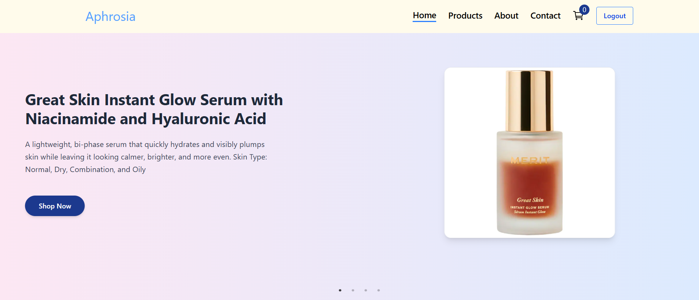
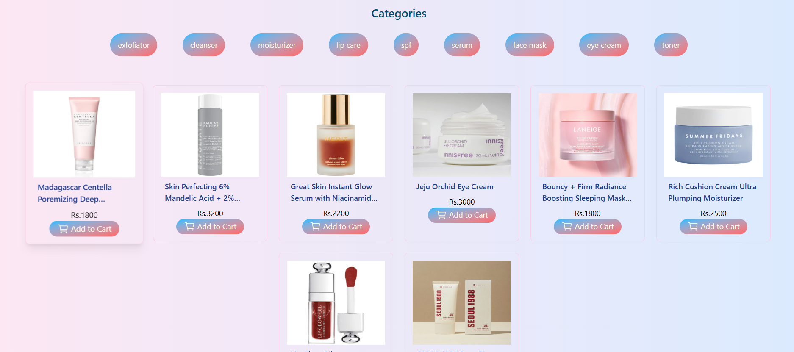
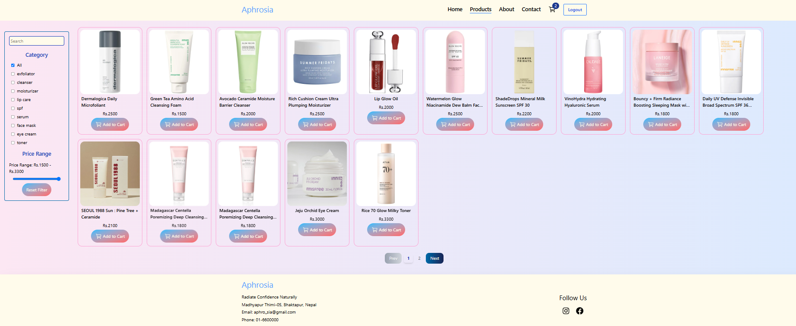
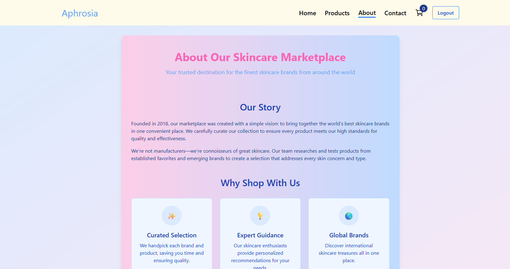
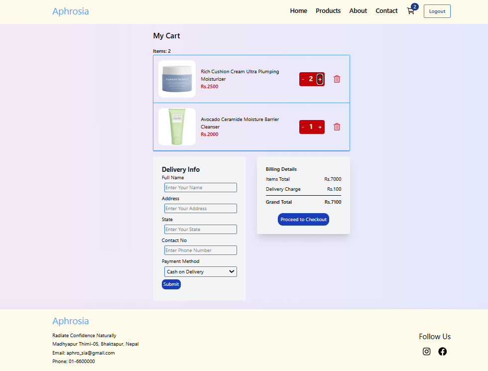

<h2>🌟Aphrosia - Skincare E-commerce Website</h2>

This project is an e-commerce application designed to sell different skincare products to customers. It provides a user friendly platform where users can browse, search and purchase skincare products

<h3>Key Features</h3>
<ul>
<li><b>User Authentication</b>: Secure login,registration and authentication with Django Session Authentication</li>
<li><b>Attractive Catalogs</b>: Attractive catalogs for display of skincare products </li>
<li><b>Cart feature</b>: Presence of cart for easy checkout</li>
</ul>
<h2>🚀 Technologies Used:</h2>
<table style="border: 2px solid black">
<th>Purpose</th>	<th>Technologies</th>
<tr><td>Frontend</td>
<td>React, Tailwind</td>
</tr>
<tr><td>Backend</td>
<td>Django Rest Framework</td>
</tr>
<tr><td>Database</td>
<td>Supabase</td>
</tr>
<table>

<h2>Snapshots of the Project</h2>
<h4>Home page</h4>

<h4>Product page</h4>

<h4>About Page</h4>

<h4>Cart Page</h4>

<h2>Setup Instructions</h2>
<h4>Prerequisites</h4>

Python 3.x installed

Node.js & npm installed

pip installed

A virtual environment tool (optional but recommended)

<h3>Steps to run the project</h3>

#### 1. Clone the Repository

git clone https://github.com/your-username/Aphrosia---E-commerce-website.git

cd Aphrosia---E-commerce-website

#### 2. Backend Setup (Django Rest Framework)

Create a Virtual Environment (optional but recommended)

python -m venv venv
Activate:
On macOS/Linux:
source venv/bin/activate

On Windows:
venv\Scripts\activate

Install Dependencies

pip install -r requirements.txt

Apply Migrations
Run migrations

python manage.py makemigrations 
python manage.py migrate

Create Superuser
This allows you to log in to the admin dashboard and add products, brands, categories, etc.

python manage.py createsuperuser

Run the Backend Server

python manage.py runserver

#### 3. Frontend Setup (React)##
cd frontend
npm install
npm run dev

Open your browser and go to: http://localhost:5173